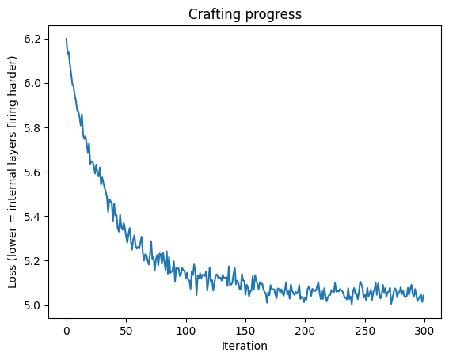

# Data-Free Universal Adversarial Perturbations

## Overview

This repository contains an implementation and experimental study of
**Data-Free Universal Adversarial Perturbations (UAPs)** for evaluating the
robustness of deep vision models.

The work is based on the data-free universal perturbation approach introduced
in prior research and was implemented using a pretrained ResNet-18 model.

The project includes reproduction of the core perturbation-generation
pipeline and an additional experiment investigating the effect of
JPEG compression on adversarial perturbation effectiveness.

## My Contribution

My contribution to this work focused on:

- Implementing and reproducing the data-free universal adversarial
  perturbation pipeline in PyTorch.
- Working with pretrained ResNet-18 and its intermediate-layer activations.
- Running the perturbation crafting and evaluation experiments.
- Evaluating the perturbation on previously unseen real images.
- Designing and conducting an additional **JPEG compression robustness
  experiment**.
- Analyzing the unexpected non-monotonic behavior of fooling rate under
  different JPEG quality levels.
- Documenting and interpreting the experimental findings.

## Research Context

Universal adversarial perturbations are designed to create a single
perturbation that can affect the predictions of many different images.

The data-free formulation explored in this project generates the perturbation
without requiring access to the original training images. Instead, random
noise inputs and intermediate activations of a pretrained network are used
during optimization.

The implementation uses a frozen ResNet-18 model and optimizes a single
perturbation using intermediate-layer activation responses.

## Methodology

```text
Pretrained ResNet-18
        ↓
Random Noise Inputs
        ↓
Intermediate Layer Activations
        ↓
Perturbation Optimization
        ↓
Universal Perturbation
        ↓
Evaluation on Real Images
        ↓
Fooling Rate
        ↓
JPEG Compression Experiment
        ↓
Robustness Analysis
```

# Experimental Setup
- Model: ResNet-18
- Framework: PyTorch
- Development Environment: Google Colab
- Perturbation Budget: ε = 10/255
- Optimization: Adam
- Learning Rate: 0.01
- Crafting Iterations: 300
- Random Noise Batch Size: 16
- Evaluation Images: 200
- Target Layers: Intermediate layers 1–4
- Compression Qualities: 100, 90, 75, 50, 25, 10
The report describes the perturbation as being crafted using random noise,
while evaluation was performed separately on real, previously unseen images.

## Results

The reproduced data-free universal perturbation experiment achieved a
**43.5% fooling rate** on the 200-image evaluation set.

### JPEG Compression Experiment

The additional experiment evaluated whether the perturbation remained
effective after JPEG compression.

| JPEG Quality | Fooling Rate |
|--------------|--------------|
|   100        |   41.0%      |
|   90         |   39.0%      |
|   75         |   34.0%      |
|   50         |   37.5%      |
|   25         |   38.5%      |
|   10         |   53.5%      |

### JPEG Compression Results



The results show a **non-monotonic relationship** between JPEG compression
quality and fooling rate. The strongest compression tested (quality 10)
produced a higher fooling rate than the uncompressed baseline.

The possible interaction between JPEG compression artifacts and the
adversarial perturbation is treated as a **hypothesis rather than a
confirmed causal explanation** and would require further experiments to
validate.

# Technologies
- Python
- PyTorch
- Torchvision
- NumPy
- Matplotlib
- PIL
- Google Colab
- ResNet-18
- Adversarial Machine Learning
- Computer Vision
  
## Repository Structure

```text
data-free-universal-adversarial-perturbations/
│
├── Data_Free_Universal_Adversarial_Perturbations.ipynb
├── Data_Free_Universal_Adversarial_Perturbations.py
├── README.md
├── requirements.txt
└── jpeg_compression_results.png
```


# How to Run
The project was implemented in Google Colab.
1. Open the notebook in Google Colab.
2. Install/import the required dependencies.
3. Download/load the required dataset as specified in the notebook.
4. Run the notebook cells sequentially.
5. Review the perturbation optimization, fooling-rate results,
   visualizations, and JPEG compression experiment.
   
# Limitations
The experiments were conducted using:
- A single ResNet-18 architecture.
- A single crafted perturbation.
- A 200-image evaluation set.
- A limited number of optimization iterations.
- A single experimental run for the JPEG compression analysis.
Therefore, the reported compression results should be interpreted as
experimental observations rather than statistically conclusive general
claims.

# Reference
The data-free universal perturbation implementation is based on prior
research on data-independent universal adversarial perturbations:
Mopuri, K. R., Garg, U., & Babu, R. V. (2017).
Fast Feature Fool: A Data Independent Approach to Universal Adversarial
Perturbations.
This repository should be viewed as an implementation/reproduction and
experimental extension of the underlying research rather than an original
invention of the UAP method.
